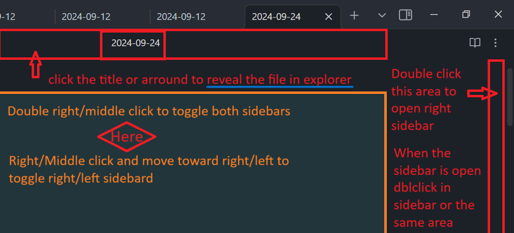
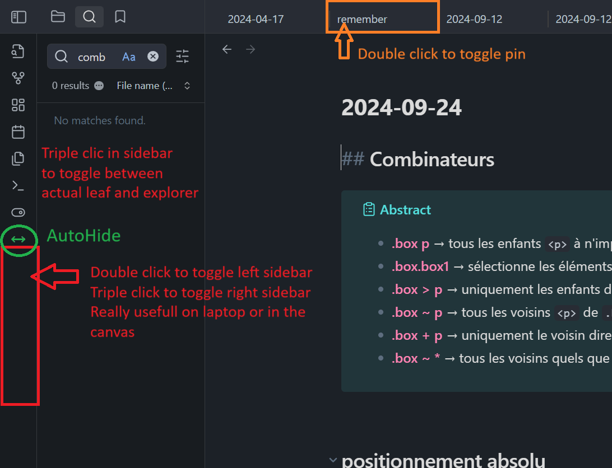

# Easy toggle sidebars

All options can be configured in the settings.
Now it's more than just a simple sidebars toggler. Images speak better than words...

  
  
 
  
- AutoHide to automatically hide sidebars when clicking on the editor  
- Minimal editor width, after it will reduce/close sidebars. (first try to reduce then close) 

- 2 Commands: "toggle both sidebars" and "toggle autohide"  

First demo:
  
  

## Development (Add this to your README)

Automate the development and publication processes on github, including releases. You are supposed to git clone your plugin out of the vault and set the right path in the .env file (1 for your trying vault, 1 for the real vault).  
  
If you want more options like sass, check out other branches     
  
### Environment Setup
  
- **Development in the plugins folder of your vault:**
  - Set the `REAL` variable to `-1` in the `.env` file. Or delete the file. Run the usual npm commands.

- **Development outside the vault:**
  - If your plugin's source code is outside the vault, the necessary files will be automatically copied to the targeted vault. Set the paths in the .env file. Use TestVault for the development vault and RealVault to simulate production.  
  
- **other steps:**   
  - You can then do `npm run version` to update the version and do the push of the changed files (package, manifest, version). Prompts will guide you.  
  
  - You can then do `npm run release` to create the release. Few seconds later you can see the created release in the GitHub releases.  

### Available Commands
  
*I recommend a `npm run start` then `npm run bacp` then `npm run version` then `npm run release`. Super fast and easy.*  
  
- **`npm run dev` and `npm start`**: For development. 
  `npm start` opens Visual Studio Code, runs `npm install`, and then `npm run dev`  
  
- **`npm run build`**: Builds the project in the folder containing the source code.  
  
- **`npm run real`**: Equivalent to a traditional installation of the plugin in your REAL vault.  
  
- **`npm run bacp`** & **`npm run acp`**: `b` stands for build, and `acp` stands for add, commit, push. You will be prompted for the commit message. 
  
- **`npm run version`**: Asks for the type of version update, modifies the relevant files, and then performs an add, commit, push.  
  
- **`npm run release`**: Asks for the release title, creates the release. This command works with the configurations in the `.github` folder. The release title can be multiline by using `\n`.